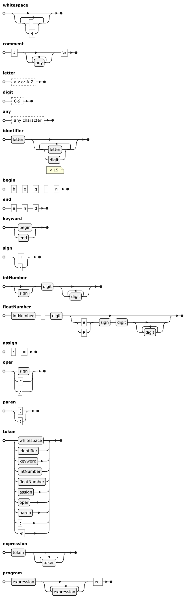

# Arithmetic Lexical Analyzer

## Overview

This project is a lexical analyzer written in Haskell designed for processing arithmetic expressions. The analyzer reads an input string (or file) containing arithmetic expressions and outputs a list of tokens. Tokens include identifiers, integer and floating-point numbers (in both standard and exponential forms), assignment operators, arithmetic operators, parentheses, semicolons, and error tokens for unrecognized or malformed input.

The analyzer was implemented as a laboratory work project in the course "Mathematical Logic and Automata Theory". It demonstrates a recursive approach to lexical analysis that is equivalent to a deterministic finite automaton, making it suitable for languages with a regular syntax.

## Features

- **Tokenization of Arithmetic Expressions:**  
  Supports identifiers (limited to 16 characters, Latin letters and digits), integer numbers, floating-point numbers (both standard and exponential forms), assignment operator (`:=`), arithmetic operators (`+`, `-`, `*`, `/`), and parentheses.

- **Error Handling:**  
  Invalid characters, malformed numbers, and incorrect identifiers (for example, if an identifier starts with a digit) are detected and reported through dedicated error tokens, allowing the analysis to continue.

- **Comment Processing:**  
  Supports comments that begin with the `#` symbol and continue until the end of the line.

- **Unique Identifier Numbering:**  
  After lexing, a separate process assigns unique numbers to identifiers to help differentiate and track them in further stages.

- **Modular Design:**  
  The code is organized into separate modules (e.g., `Lexer` and `Printer`), making it easy to extend functionality (add more tokens or adjust rules) and integrate the analyzer into larger projects.

- **Automata-based Approach:**  
  The recursive lexing function closely mimics the transitions of a deterministic finite automaton (DFA), ensuring theoretical correctness and simplifying the implementation of token recognition rules.

## Syntactic Diagram



## Project Structure

- `src/Lexer.hs`  
  Contains the implementation of the lexical analyzer, including token definitions, main lexing function (`lexer`), helper functions (`lexerAssign`, `lexKeywordOrIdentifier`, `lexSignedNumber`), and the routine for assigning unique numbers to identifiers.

- `src/Printer.hs`  
  Contains functions for formatting and printing the token table.

- `README.md`  
  This file.

- `LICENSE`  
  (Optional) License information.

## Requirements

- [GHC (Glasgow Haskell Compiler)](https://www.haskell.org/ghc/) v9.6.6 or later
- [Stack](https://docs.haskellstack.org/en/stable/README/) for building the project
- VSCode (or any other preferred Haskell IDE/editor)

## Building and Running

1. **Clone the Repository:**

    ```bash
    git clone https://github.com/StanleyStanMarsh/arithmetic-lexical-analyzer.git
    cd arithmetic-lexical-analyzer
    ```

2. **Build the Project using Stack:**

    ```bash
    stack build
    ```

3. **Run the Analyzer:**

    ```bash
    stack exec arithmetic-lexical-analyzer-exe
    ```

The program will prompt you to choose an input file for analysis.

## Further Development and Integration

- **Extensibility:**
The modular design of the lexer and printer modules allows for easy expansion. New token types, additional language constructs, or more sophisticated error handling mechanisms can be integrated with minimal changes to the existing code.

- **Integration into Compilers/Interpreters:**
This lexical analyzer can serve as the initial stage in the compilation pipeline for a small programming language. It can be combined with a parser (possibly generated by a parser combinator library) to build a complete compiler or interpreter.

- **Scalability:**
While the current implementation is efficient for small to medium-sized input texts, further optimizations or a transition to parser generators (such as Alex for Haskell) might be necessary for extremely large inputs or more complex language grammars.

## License

[](https://opensource.org/licenses/BSD-3-Clause)

This project is licensed under the BSD-3-Clause License. You can find the complete license details in the [LICENSE](LICENSE) file.