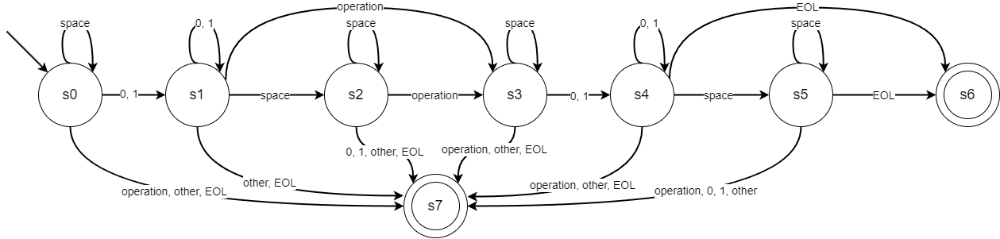

# binary-parser

Этот проект представляет собой парсер, который читает строки из текстового файла .txt, содержащие значения и бинарные операции над ними. Поддерживаемые операции включают AND (&), OR (|) и XOR (^). Проект написан на языке Haskell и использует библиотеку Lib.hs для чистых функций и вспомогательных операций.

## Формальное описание парсера

Парсер реализован как детерминированный конечный автомат (ДКА), который распознает строки вида `  10101   |101   `.



*На графе operation = {&, |, ^} - множество допустимых бинарных операций*

### Формальное определение

M = (Q, Σ, δ, q₀, F), где:

- Q = {s₀, s₁, s₂, s₃, s₄, s₅, s₆, s₇} - множество состояний автомата
- Σ = {0, 1, space, &, |, ^, other, EOL} - входной алфавит
- q₀ = s₀ - начальное состояние
- F = {s₆} - множество допускающих состояний
- δ : Q × Σ → Q - функция переходов, определенная следующей таблицей:

| Состояние | space | 0,1 | &,\|,^ | other | EOL |
|-----------|-------|-----|--------|--------|-----|
| s₀        | s₀    | s₁  | s₇     | s₇     | s₇  |
| s₁        | s₂    | s₁  | s₇     | s₇     | s₇  |
| s₂        | s₂    | s₇  | s₃     | s₇     | s₇  |
| s₃        | s₃    | s₄  | s₇     | s₇     | s₇  |
| s₄        | s₅    | s₄  | s₇     | s₇     | s₇  |
| s₅        | s₅    | s₇  | s₇     | s₇     | s₆  |
| s₆        | s₇    | s₇  | s₇     | s₇     | s₇  |
| s₇        | s₇    | s₇  | s₇     | s₇     | s₇  |

### Семантика состояний:
- s₀: Начальное состояние, ожидание первого бинарного числа
- s₁: Чтение первого бинарного числ��
- s₂: Ожидание бинарной операции
- s₃: Ожидание второго бинарного числа
- s₄: Чтение второго бинарного числа
- s₅: Ожидание конца строки
- s₆: Допускающее состояние
- s₇: Состояние ошибки

### Примечания:
- Автомат принимает строки формата: `[пробелы][бинарное число][пробелы][операция][пробелы][бинарное число][пробелы]`
- Состояние s₇ является поглощающим состоянием ошибки
- Любой символ, не принадлежащий алфавиту, считается как 'other' и приводит к переходу в состояние ошибки s₇
- other = {c ∈ UTF-8 | c ∉ {0, 1, space, &, |, ^, EOL}} - все символы UTF-8, не входящие в алфавит Σ

## Установка и запуск

Для запуска проекта необходимо установить пакетный менеджер Stack для Haskell. После этого выполните следующие шаги:

```bash
git clone https://github.com/StanleyStanMarsh/binary-parser.git
cd binary-parser
stack build
stack exec binary-parser-exe
```


При запуске программа запросит у вас имя файла для обработки. Введите название файла и нажмите Enter. Программа произведет синтаксический разбор содержимого файла и выведет результат вычислений на экран.

## Структура проекта

Проект состоит из нескольких файлов:

- `app/Main.hs`: Основной модуль приложения, отвечающий за взаимодействие с пользователем и вызов функций библиотеки.
- `src/Lib.hs`: Библиотека с чистыми функциями и вспомогательными методами для работы с битами и операциями.

## Примеры входных данных

Файлы могут содержать строки следующего вида:

- 01010 & 10101

- 11011 ^ 00100


Результатом выполнения этой строки будет значение, полученное после применения всех указанных операций к соответствующим битовым строкам.

## Лицензия

Этот проект распространяется под лицензией BSD-3-Clause. См. файл LICENSE для получения дополнительной информации.